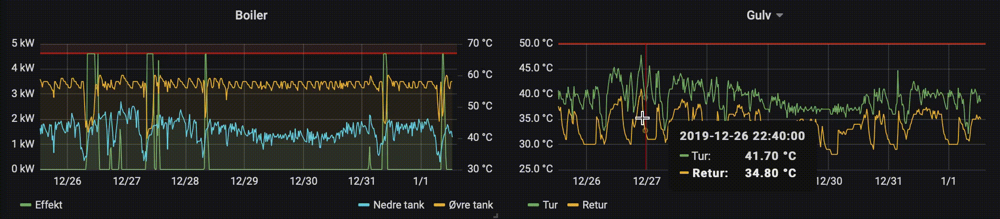
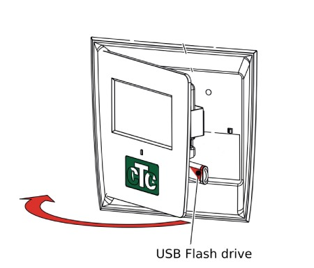

Parses CTC EcoZenith Heater CSV files for input to an influxdb database. I use Grafana for visualizing the heater data:

The script will find all csv files in a directory and parse the data, label it, making it timzone aware and push it to 
an influxdb database before deleting the csv files. It has only been tested with my own setup which consist of a 
CTC EcoZenith i250 immersion heater, CTC EcoAir 400 heat pump and one flow loop of underfloor heating.

I have uploaded one of my csv files for reference: [20200101.CSV](./resources/20200101.CSV)

# How to use

### Heater
1. Carefully open the touch screen lid and add an empty thumb drive (formatted as FAT32) into the USB slot as indicated:

2. Start logging by following setting on the touch screen:
    1. Installer settings
    2. Service
    3. Write log to USB

As far as I have seen the thumb drive can be removed and added without having to restart logging from the touch screen.

### Computer

Prerequisites:
* Python (with pandas, numpy and influxdb) installed
* Running Influxdb instance with a database called 'ctc'

Instructions:
1. Download the ctc.py file to a directory on your computer
2. Change following parameters in the ctc.py file to accomodate your setup:
    * influxdb parameters (user/pass and optionally host/port/dbname)
    * Timezone, default is 'CET'
3. Copy some csv files from the thumb drive to the directory where the ctc.py file is
3. Run the script with following command from the directory: `python ctc.py`

